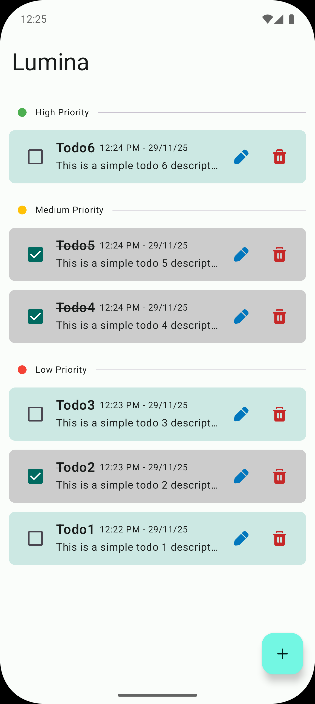
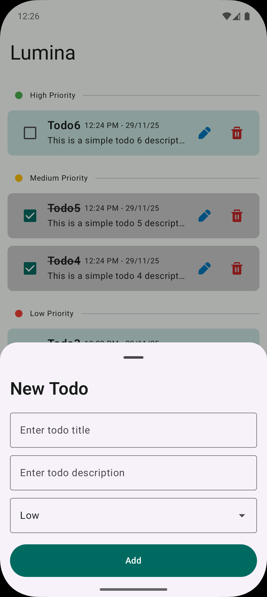
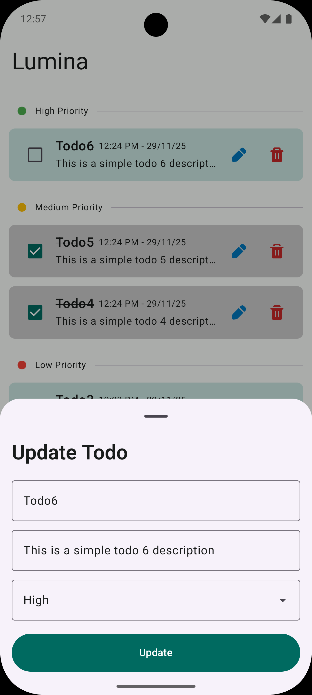
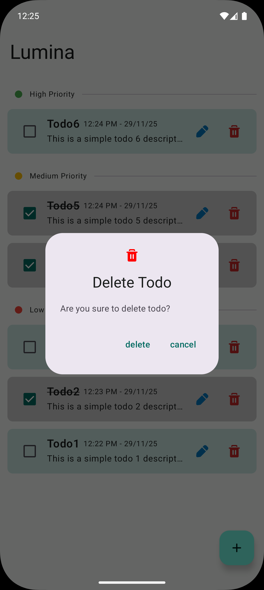
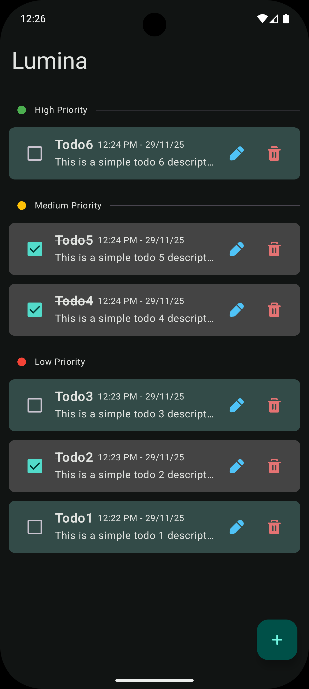
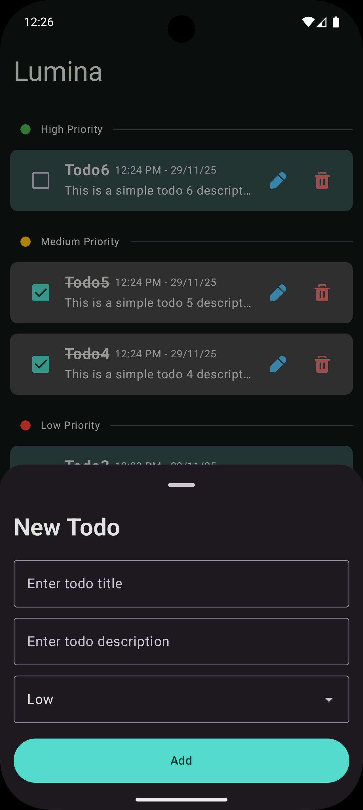
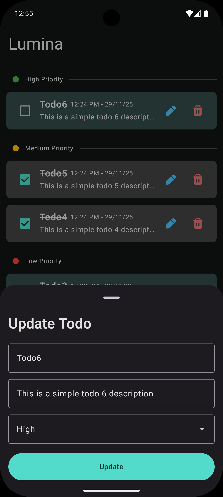
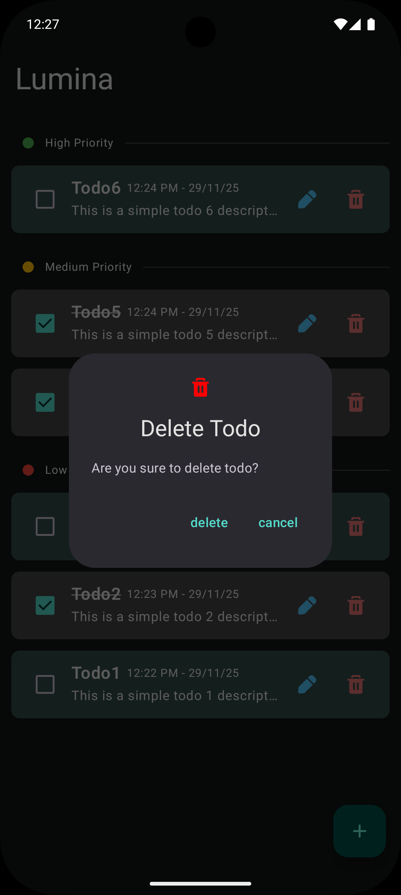

# Lumina 📝


> **The fastest way to manage daily tasks. Simple, clean, and distraction-free.**

**Lumina** is an open-source, privacy-focused to-do list app built for Android using modern development standards. It is designed for users who want to get things done without complex menus, ads, or tracking.

<table>
  <tr>
    <td></td>
    <td></td>
    <td></td>
    <td></td>
  </tr>
  <tr>
    <td></td>
    <td></td>
    <td></td>
    <td></td>
  </tr>
</table>

## ✨ Features

* **🚀 Minimalist UI:** No clutter, just your tasks.
* **⚡ Instant Add:** Create tasks in milliseconds.
* **🌑 Dark Mode:** Fully supported Material Design dark theme.
* **🔒 Privacy First:** 100% offline. Data is stored locally using Room Database.
* **👆 Gestures:** Swipe to delete, tap to complete.

## 🛠 Tech Stack

Lumina is built with **Modern Android Architecture** in mind:

* **Language:** [Kotlin](https://kotlinlang.org/)
* **UI:** [Jetpack Compose](https://developer.android.com/jetpack/compose) (Material 3)
* **Architecture:** MVVM (Model-View-ViewModel)
* **Local Storage:** [Room Database](https://developer.android.com/training/data-storage/room)
* **Asynchronous:** Kotlin Coroutines & Flow

## 📥 Download

<a href='https://play.google.com/store/apps/details?id=com.yourname.lumina'>
    
</a>

You can download the latest APK from the [Releases Page](https://github.com/codewithcc/lumina-todo-app/releases).

## 💻 Building Locally

If you want to build the app yourself or contribute:

1.  **Clone the repo:**
    ```bash
    git clone https://github.com/codewithcc/lumina-todo-app.git
    ```
2.  **Open in Android Studio:**
    * Open Android Studio -> File -> Open -> Select the `lumina` folder.
3.  **Sync Gradle:**
    * Wait for the project to download dependencies.
4.  **Run:**
    * Press the ▶️ Run button to deploy to an emulator or physical device.

## 🤝 Contributing

Contributions are what make the open-source community such an amazing place to learn, inspire, and create. Any contributions you make are **greatly appreciated**.

1.  Fork the Project
2.  Create your Feature Branch (`git checkout -b feature/AmazingFeature`)
3.  Commit your Changes (`git commit -m 'Add some AmazingFeature'`)
4.  Push to the Branch (`git push origin feature/AmazingFeature`)
5.  Open a Pull Request

## 📄 License

Distributed under the MIT License. See `LICENSE` for more information.

## 📧 Contact

**Chanchal Roy** - [LinkedIn](https://linkedin.com/in/codewithcc)

Project Link: [https://github.com/codewithcc/lumina-todo-app](https://github.com/codewithcc/lumina-todo-app)